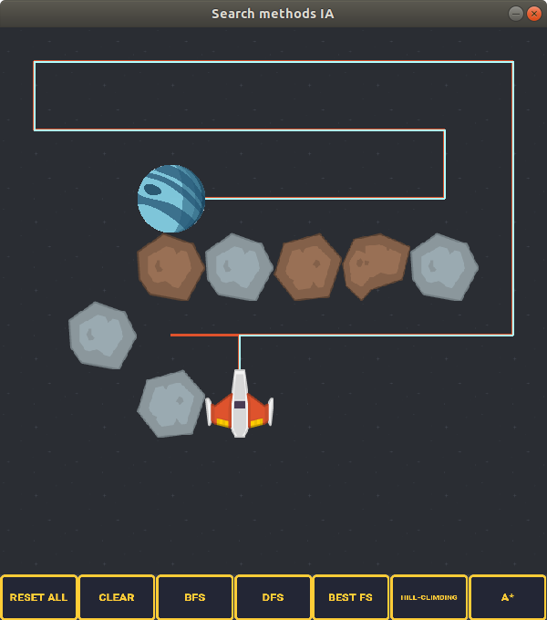

# Proyecto 2: Métodos de búsqueda simples
#### Autor: Ivan Raymundo Feliciano Avelino

## Introducción

Los métodos de búsqueda implementados
en el proyecto son los siguientes:

+ A tientas:
    
    * Búsqueda en amplitud (BFS por sus siglas en inglés).
    * Búsqueda en profundidad (DFS por sus siglas en inglés).
+ Heurísticos:
    
    * Ascenso de colina.
    * Primero el mejor.
+ Ruta óptima

    * A*.

El programa no muestra explícitamente la 
cuadrícula sobre la cual se mueve un 
robot, en cambio, se presenta
una nave espacial (el robot) que debe
navegar en un espacio con
asteroides (obstáculos) para llegar a un planeta (meta).


*Ejemplo de una configuración del la cuadrícula y como método de búsqueda una DFS.*


## Instalación y ejecución

Para ejecutar el programa es necesario
instalar `pygame`. Para esto, instalamos
las dependencias en el archivo `requisitos.txt`:

```bash
$ pip install -r requisitos.txt
```

Para iniciar la aplicación pasamos como
parámetro en la línea de comandos
el tamaño de la cuadrícula (por defecto
tiene un valor de 8).

```
$ python space_board.py  --n 10
```

El comando anterior produce una ventana como la siguiente


Ahora, ya podemos definir la posición
de inicio y de la meta, así como la 
de los obstáculos para una configuración
arbitraria. 

Después de haber definido todos lo mencionado ya podemos ejecutar cualquiera de los métodos de búsqueda.

## Algunas notas sobre los algoritmos

La secuencia del movimiento
del agente durante las
búsquedas es:

+ Arriba
+ Izquierda
+ Derecha
+ Abajo

La función heurística *h(n)* es la
distancia Manhattan, *h(n) = |n.row - goal.row| + |n.column - goal.column|*.
Esta función está implementada en el
archivo `utils.py`.

La estructura de datos utilizada
en el algoritmo primero el mejor
y A* es una cola de prioridad que 
mantiene al elemento con el menor peso
al frente.


## Ejemplos

### Caso 1
**Configuración inicial n = 8**


**BFS**


**DFS**



**Primero el mejor**


**Ascenso de colina**


**A\***


### Caso 2


**Configuración inicial n = 20**


**BFS**


**DFS**


**Primero el mejor**


**Ascenso de colina**


**A\***


### Caso 3

**Configuración inicial n = 8**


**BFS**


**DFS**


**Primero el mejor**


**Ascenso de colina**


**A\***


